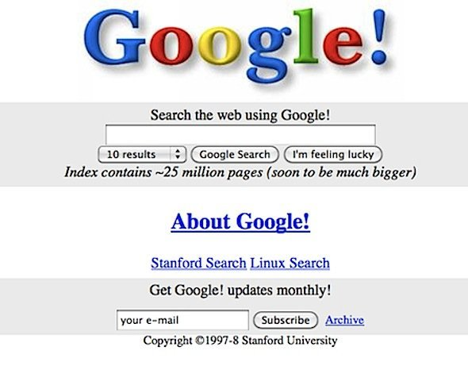
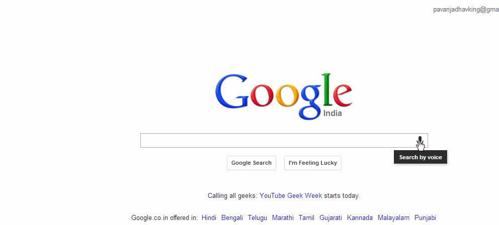
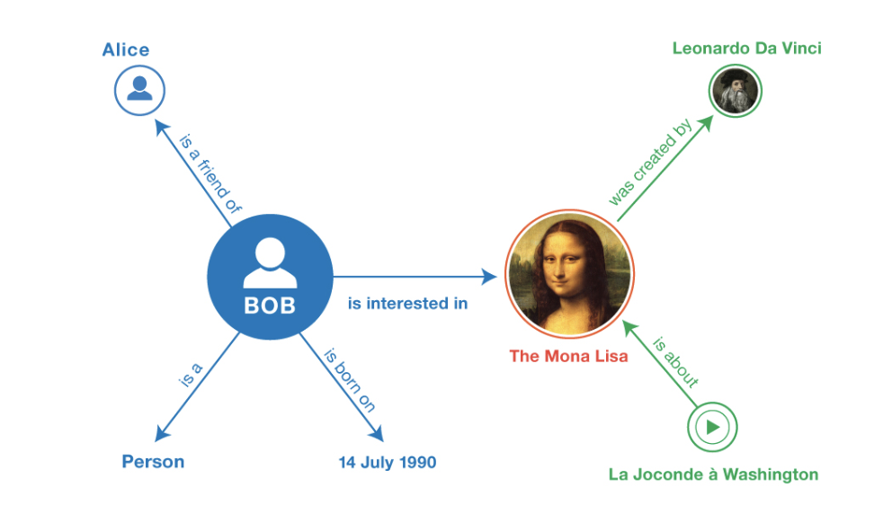
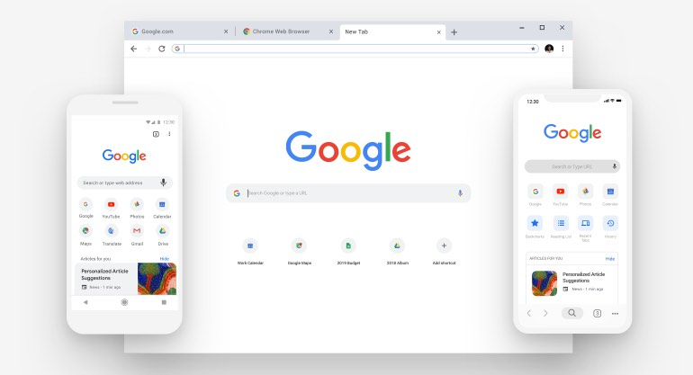

# Webinar 1 - The Complete Guide to Coding during the Lockdown

## `Effort + Wrong Tools != Success`

## 

 

Go through everything, it will give you a good overview and give you the big picture, and will ensure you feel less lost once you finish a tutorial for a new language/framework and have no clue what to do.

But if you are still too lazy, here's the **<a href="#TLDR">TL;DR</a>** or watch the video on Youtube.

# Overview of Programming

> What can I accomplish by learning to code ?

> What can I build ?

# Platforms

- ## [Web](#Web) (Websites and Webapps - Ex: Google.com, Facebook.com, Twitter.com)

- ## [Desktop](#Desktop) (Applications like: Notepad, Microsoft Word, Adobe Photoshop, Games)

- ## [Mobile](#Mobile) (Android and iOS apps: Whatsapp, Snapchat)

- ## [Others](#Others) (VR, Embedded Systems: Raspberry Pi, Arduino)

# But before that

> Why should you build something ?

> With what should I build ?

# What do I want to build ?

> The next Facebook ?

> An AI that can play video games

> Just tinker

# What do I need to execute my idea ?

## Prepare a checklist

**Do I need a..**

- [x] [Website](#Web) ?
- [x] [Desktop App]() ?
  - [x] [Windows]() ?
  - [ ] [Mac]() ?
  - [ ] [Linux]() ?
- [x] [Mobile App]() ?
  - [x] [Android]() ?
  - [x] [iOS]() ?

## Some Fundamentals

### Front End

> What you see
> Look and feel of your application, the User Interface

### Back End

> What you don't see
> Databases, APIs and other Logic that makes the magic happen behind the scenes

# <a id="Web">Web</a>

## Front End

---

You need to understand HTML, CSS and Javascript (JS) to build websites. HTML is like the skeleton, while CSS is your skin that defines your looks, and Javascript is the nervous and Brain running your body.

### Just HTML

### HTML + CSS

### HTML + CSS + JS

## Beautify your websites with little effort

The following add styling and animations to your websites with very little modifications.

- [Bootstrap](https://getbootstrap.com/)
- [Material-UI](https://material-ui.com/) (Looks just like Android Apps made by google)
- [Materialize](https://materializecss.com/) (Looks just like Android Apps made by google)
- [Bulma](https://bulma.io/)

## I want to build Complicated Websites that are like Apps

- [ReactJS (Developed by Facebook)](http://reactjs.org/) (Personal Favorite will explain below why)
- [AngularJS (Developed by Google)](https://angularjs.org/)

## Back End

### Server Side Languages/Frameworks

- [node.js](https://youtu.be/fBNz5xF-Kx4)
  - [express.js](https://www.youtube.com/playlist?list=PLillGF-RfqbYRpji8t4SxUkMxfowG4Kqp) (Personal Favorite, easy to get started with, Completely Do it Yourself)
  - [strapi](https://strapi.io/) (Just started exploring this, first impressions are good, it's just like Django in so many ways but with more.)
- [python](https://www.youtube.com/playlist?list=PLQVvvaa0QuDeAams7fkdcwOGBpGdHpXln)
  - [django](https://www.youtube.com/playlist?list=PL6gx4Cwl9DGBlmzzFcLgDhKTTfNLfX1IK) (Most Robust Option! Everything you'll mostly need is already built in, uses best practices for everything! Good starting Point)
  - [flask](https://www.youtube.com/playlist?list=PL-osiE80TeTs4UjLw5MM6OjgkjFeUxCYH) (More Do it Yourself)
  - [sanic](https://sanic.readthedocs.io/en/latest/) (Much more barebones than Flask. Relatively New)
  - [fastapi](https://fastapi.tiangolo.com/) (Similar to flask and co. Relatively New, the fastest among all)

### Database (Store, Retrieve and Modify Data)

| id  | name            | home     |
| --- | --------------- | -------- |
| 1   | Batman          | Gotham   |
| 2   | Superman        | Krypton  |
| 3   | Iron Man        | New York |
| 4   | Captain America | Brooklyn |

- SQL (MySQL, SQLite, PostgreSQL) (It's everywhere, almost everyone uses it and hence has lots of support)

| id  | followers |
| --- | ------ |
| 1   | 20M   |
| 2   | 12M   |
| 3   | 25M   |
| 4   | 18M   |

| id  | following      |
| --- | -------------- |
| 1   | 0  |
| 2   | \$2.4 million  |
| 3   | 85 |
| 4   | -              |

- NoSQL
  - [MongoDB](https://www.youtube.com/watch?v=pWbMrx5rVBE) (Much more prototype friendly, especially when you are just figuring out how to store your data, unstructured or wildly connected data with no common patterns)
- Graph Databases
  - [Neo4j](https://neo4j.com/) (For data that has lots of relationships)

Choose SQL when you know exactly in what way you want to structure your data and return it. NoSQL is really suitable when your data is highly unstructured and you just need to store it and perform operations on it and don't care about how it is modeled internally.

### Follow [Hybrid Approaches](#Hybrid) that allow you to build a Website that works like a mobile and desktop app.

# <a id="Desktop">Desktop</a>

---

P.S. Everything that runs on a Desktop will run on your server, so the programs you write for this platform, can be integrated into your backend services and served using websites.

- **JavaScript (Node.js)**: Now we use JS to build websites, and it is pretty simple to learn and get started with, it is also possible to use the existing knowledge of JS and build applications uisng certain frameworks.

  - [Electron](https://www.electronjs.org/): Build apps for all 3 platforms (**Windows**, **MacOS**, **Linux**) without hassle. The best option in the list.

- **Java** and **C#**: Allow you to create decent looking applications with good **User Interfaces**, that will work on all 3 platfroms (**Windows**, **MacOS**, **Linux**), no code changes needed!

  - Windows Tips:

    - When Using C#, you can choose between WinForms, WPF and UWP.

      - WinForms: Basically how plain 90s era Windows Apps Look
      - WPF: Higher Degree of customization. Uses XAML (similar to HTML essentially) to define UI and add styling like CSS with attributes.
      - UWP: (Universal Windows Platform) Allows you to write an App once and have it run on all Windows Platforms like Windows 10, XBOX, Hololens, Windows Phone (if your customers use it) etc.
      - [Unity](https://www.youtube.com/playlist?list=PLPV2KyIb3jR5QFsefuO2RlAgWEz6EvVi6) or [Unreal Engine](https://www.youtube.com/watch?v=LsNW4FPHuZE): For building games

* **Python**, **C++**:

  - **Python**: The go to for Machine Learning, Graphical Visualizations, and other automation tasks. (The easiest Language to Start with, and easiest to read) (Best for Prototyping high performance applications)

    - [tkinter](): Build user interfaces
    - [pyGame](): Make simple games
    - [tensorflow](https://www.youtube.com/watch?v=tPYj3fFJGjk) (Made by Google): For Machine Learning and GPU Compute
    - [pytorch]() (Made by Facebook): For Machine Learning and GPU Compute
    - [pandas](): For Data Structuring and organization
    - [numpy](): Contains all the mathematical functions in python (Exponents, log, max, min etc)
    - [matplotlib](): Lets you visualize data in the form of Graphs.

    Python is most suitable for creating scripts that run when called from a terminal or some other process, you can use the same concept to have another application (say a node.js application) trigger a python process.

 

- **C++**: The most performant Language you could learn. It will run the fastest, and will always be the best language to implement your final version of the code if you are building something that is resource heavy. (Is Harder to get started with, and I do not recommend learning this as your first programming language. Start with Javascript or Python really! Then pick this.)

### Follow [Hybrid Approaches](#Hybrid) that allow you to build a Website that works like a mobile and desktop app.

# <a id="Mobile">Mobile</a>

---

## Android

- [Kotlin](https://www.youtube.com/watch?v=Iz08OTTjR04)
- [Java]()

## iOS

- [Swift](https://www.youtube.com/watch?v=comQ1-x2a1Q)
- [Objective C]()

There's nothing much to be said here, if you want to build Apps, you have to learn one or more of those. With that you can build Games, Banking Apps, Todo Lists what have you.

## Both at once ?!!

Yes this is very much possible, you can write code once and build an Android and iOS Application at once!

- [Flutter](https://youtu.be/pTJJsmejUOQ) (Uses Dart a Java like language, strongly typed. But can create one of the most beautiful limitless set of screens possible and is best option. And performs like it was natively written code.)
- [React Native](https://youtu.be/Hf4MJH0jDb4) (Javascript and Node.js knowledge) You can write code that is similar to [ReactJS](https://youtu.be/sBws8MSXN7A) and build apps for both platforms

Flutter is my personal Favorite solely because of flexible it is. Beautiful UIs, fast builds everything is perfect.

# <a id="Others">Others</a>

---

Arduino is probably the most famous one out there for getting custom electronics projects done. Won't say much, if you have a foundation in programming and want to try some electronics projects or vice versa, you can explore [Arduino Projects](https://create.arduino.cc/projecthub). The best way is to build really.

# <a id="Hybrid">Hybrid Approaches</a>

---

Hybrid Approaches basically allow you to write code for one platform and have it work on another with little to know hacks.

## Mobile + Web in 1:

- **ReactJS** for Web and **React Native** for iOS & Android (Most core fundamentals are the same, and the knowledge you gain in either translates to the other)
  React Allows you to build [PWAs](https://www.youtube.com/watch?v=VmKePMB0C8Q)
- **Flutter** (You have to learn a Java-esque language called Dart but it's pretty promising and the beautiful UIs you can make through this is amazing.)

**Additional**: **ElectronJS** allows you to turn WebApps writted in ReactJS, Angular into desktop apps.

# <a id="TLDR">TL;DR Just tell me what is best to learn! </a>

---

- If you just want to learn to code and will figure out what to build afterwards, choose one of the 2:

  - [Python](https://www.youtube.com/playlist?list=PLQVvvaa0QuDeAams7fkdcwOGBpGdHpXln)
    If you want to work on ML, Data Analysis later on.
  - [JavaScript](https://www.youtube.com/watch?v=hdI2bqOjy3c)
    If you want to build websites and web oriented projects.

I'd never recommend anything beyond these 2 as your first language, then you could learn whatever suits your needs in the domain you desire.
